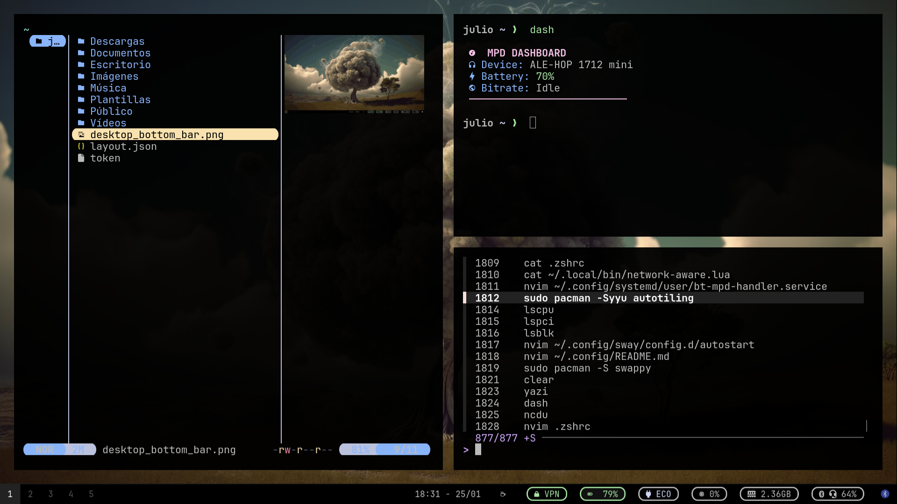
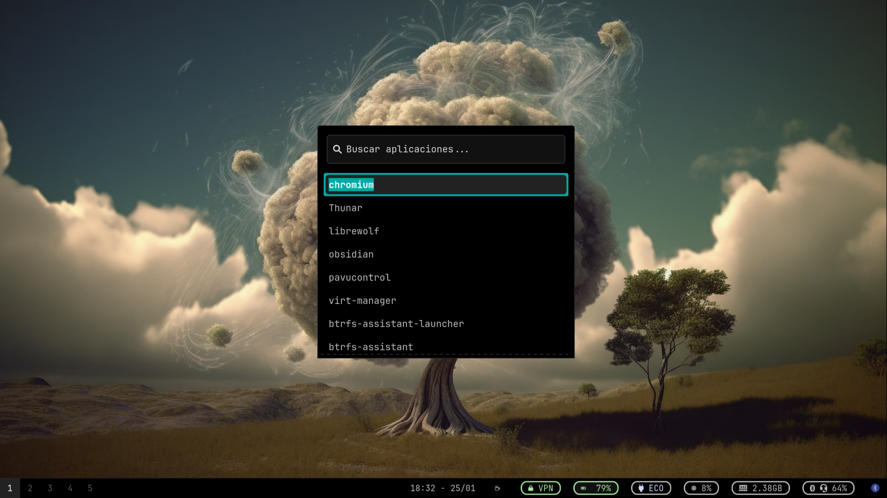

# 📁 Dotfiles: Arch Linux on Lenovo 💻


Configuración minimalista y de alto rendimiento optimizada para hardware AMD Mendocino. El entorno se basa en Sway con una arquitectura modular, automatización en Lua y un esquema de almacenamiento avanzado.

<br>

## 📸 Galería del Setup

<details>
  <summary>Click para ver capturas de pantalla</summary>

  ### 🖥️ Escritorio (Gaps + Waybar Bottom)
  *Configuración minimalista con el panel en la parte inferior para maximizar el área de trabajo.*
  

  ### 🎧 Bluetooth Dashboard (Lua)
  *Script personalizado en Lua para el control y estado de los auriculares ALE-HOP.*
  

  ### 🛠️ Gestión de Ventanas (Autotiling)
  *Demostración de los gaps y el flujo dinámico de ventanas.*
  

</details>

<br>

## 🛠️ Stack Tecnológico & Hardware


* **Laptop:** Lenovo (AMD Ryzen con **Radeon 610M** Graphics).

* **OS:** [Arch Linux](https://archlinux.org) (Repos: Core, Extra, [**Chaotic-AUR**](https://github.com/chaotic-aur)).

* **AUR Helper:** `paru`.

* **WM:** [Sway](https://github.com/swaywm/sway) + **Autotiling** (gestión dinámica de ventanas).

* **Shell:** `zsh` + `starship` + `JetBrainsMono NF`.

* **File Manager:** `yazi` (CLI).

* **Audio:** `mpd` + `ncmpcpp` + `pipewire`.

<br>

## 🏗️ Sistema de Archivos & Seguridad

Instalación profesional orientada a la resiliencia de datos y seguridad:

* **Cifrado:** **LUKS** (Full Disk Encryption).

* **Memoria:** **ZRAM** para compresión de RAM + **Swapfile** de respaldo.

* **FS: BTRFS** con una estructura de subvolúmenes optimizada para snapshots:

* `@` (root) y `@home` (datos de usuario).

* `@log` y `@cache` (excluidos de snapshots para ahorrar espacio).

* `@libvirt` (aislamiento para VMs).

* `@tmp` y `@swap` (gestión de archivos temporales y paginación).

* `@snapshots` (almacenamiento de estados del sistema).

<br>

## 📂 Estructura de .config (Modular)

La configuración de Sway está fragmentada para facilitar el mantenimiento:

* `sway/`: Módulos de `appearance`, `autostart`, `binds`, `hardware`, `variables` y `window_rules`.

* `systemd/user/`: Servicios como `bt-mpd-handler.service`.

* `chromium-flags.conf`: Habilitación de Wayland nativo y VA-API para la Radeon 610M.

* `waybar/` & `wofi/`: Interfaz visual y lanzador.

<br>

## ⚙️ Automatización con Lua (`.local/bin`)

Scripts que sustituyen al Bash tradicional para una lógica más robusta:

* `volume-adjust.lua`: Ajusta automáticamente el volumen al 40% al conectar los auriculares **ALE-HOP**.

* `network-aware.lua`: Monitoriza el tráfico de la tarjeta **MediaTek MT7921* (`wlan0`) vía `/proc/net/dev`.

* `dashboard.lua`: Panel central de información auriculares **Bluetooth ALE-HOP**.

<br>

## 🐚 Shell & CLI Experience (zsh)

* **Navegación:** `zoxide` (cd inteligente) y `fzf` con esquema de colores personalizado.

* **Visualización**: `eza` con iconos y previsualización de árboles (`ftree`).

* **Entorno:** Soporte Wayland y aceleración `radeonsi` configurados en `.zshenv`.

* **Yazi:** Función `y()` para sincronizar el directorio de trabajo al cerrar el gestor.

<br>

## 🔄 Servicios de Usuario (Systemd)

`bt-mpd-handler.service`

Coordina la música con el estado del hardware:

1. **ExecStart:** Inicia la reproducción en `mpc`.

2. **ExecStartPost:** Ejecuta el script de Lua para configurar el volumen de los auriculares.

3. **ExecStop:** Pausa la música automáticamente al detener el servicio.

<br>

## 🚀 Gestión de Dotfiles (Bare Repo)

Uso el método de **Bare Repository**, manteniendo el `$HOME` limpio de archivos `.git`.

**Alias de gestión:**

```Bash
alias config='/usr/bin/git --git-dir=$HOME/.cfg/ --work-tree=$HOME'
```

**Instalación desde cero:**

```Bash
git clone --bare https://github.com/juliomena81/dotfiles-laptop-lenovo-sway-wm.git $HOME/.cfg
alias config='/usr/bin/git --git-dir=$HOME/.cfg/ --work-tree=$HOME'
config checkout
config config --local status.showUntrackedFiles no
```

<br>

## ⌨️ Atajos Clave

* **Mod + Enter**: Terminal (`foot`)

* **Mod + d:** Menú (`wofi`)

* **Mod + Shift + w:** Web Browser (LibreWolf)

* **Autotiling:** Activado para conmutar automáticamente entre layouts horizontales y verticales.

<br>

**Nota para Lenovo:** El archivo `chromium-flags.conf` habilita el soporte de **Wayland nativo** y la **aceleración por hardware** en la GPU, **reduciendo el tearing** y el uso de CPU.
